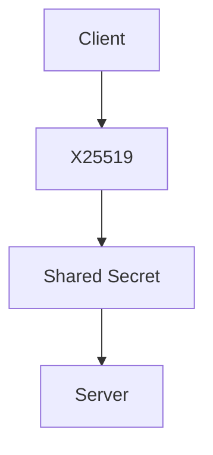
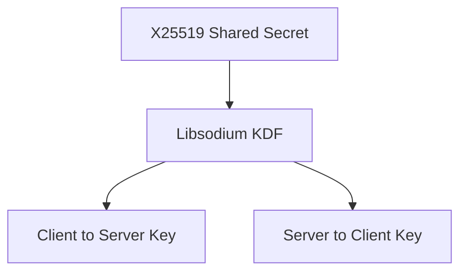
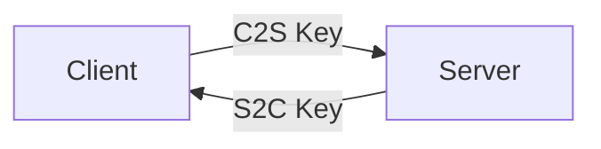
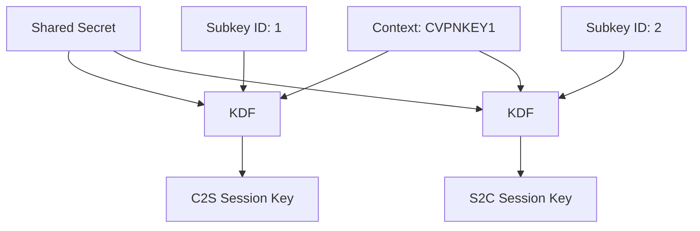
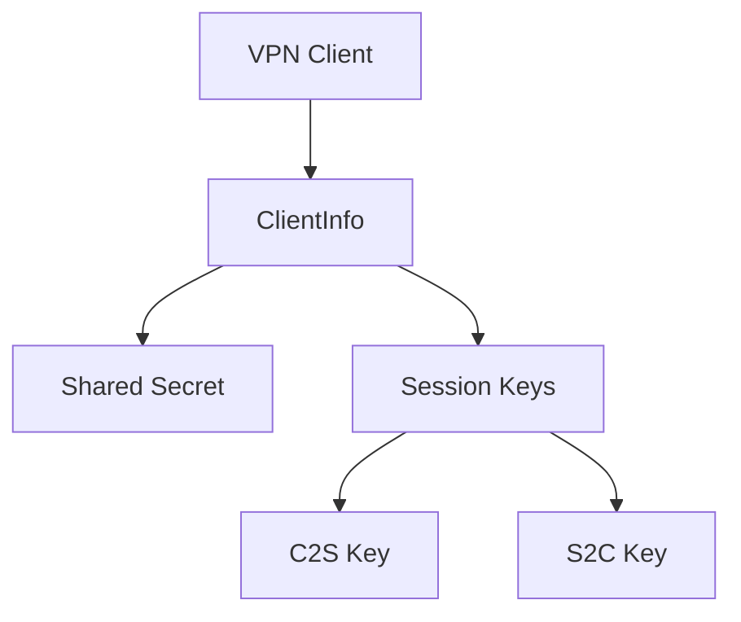
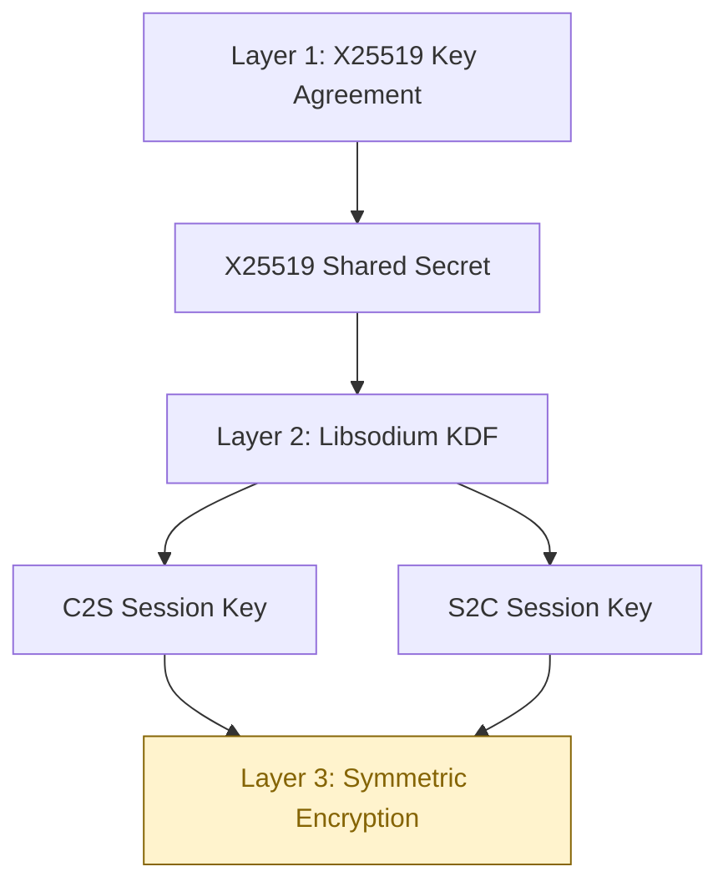

# Layer 2 — Session Key Derivation

Layer 2 prepares the VPN for future symmetric packet encryption. It takes the shared secret created by Layer 1 and derives separate keys for traffic in each direction.

## 1. Purpose

Layer 1 gives the Client and Server a common X25519 shared secret. The secret is derived independently by both sides and is not sent over the network.

Layer 2 uses that shared secret as input to a Libsodium key-derivation function. It creates the actual directional session keys that Layer 3 will later use for symmetric encryption.

**Layer 2 does NOT encrypt VPN packets.**

## 2. Before Layer 2

Layer 1 performs the X25519 key agreement:



More precisely, the Client and Server exchange public keys and independently calculate the same shared secret. The shared secret itself is never transmitted.

## 3. What Layer 2 Adds

Layer 2 derives two independent keys from the shared secret with Libsodium:



Two keys are used so that traffic sent in one direction does not reuse the key used in the opposite direction.

The keys are stored in `SessionKeys`:

```cpp
struct SessionKeys
{
    SessionKey clientToServer{};
    SessionKey serverToClient{};
};
```

## 4. Why Separate Keys?



- C2S means Client → Server.
- S2C means Server → Client.
- The same key is not reused in both directions.

Both peers derive the same pair independently:

```text
Client C2S == Server C2S
Client S2C == Server S2C
C2S != S2C
```

## 5. How the KDF Works

The implementation uses Libsodium's `crypto_kdf_derive_from_key()` function. It does not implement a custom KDF and does not use SHA-256 as the KDF.

Conceptually, each session key is derived from these inputs:

```text
Shared Secret
      +
VPN KDF Context
      +
Subkey ID
      ↓
Libsodium KDF
      ↓
Session Key
```

The code uses the 8-byte context `CVPNKEY1`. It uses subkey ID `1` for Client → Server and subkey ID `2` for Server → Client:



The distinct subkey IDs provide domain separation between the two directions. Each output is a Libsodium-compatible 32-byte key.

## 6. Client-Side Changes

The client creates its session-key container alongside the existing X25519 material in `client/client1.cpp`:

```cpp
X25519SharedSecret sharedSecret{};
SessionKeys sessionKeys{};
```

`receiveHandshake()` in `client/transport.cpp` first derives the X25519 shared secret. Once that succeeds, it derives the session keys:

```cpp
if (!deriveSessionKeys(sessionKeys, sharedSecret))
{
    cerr << "Failed to derive session keys" << endl;
    wipeX25519SharedSecret(sharedSecret);
    return "";
}
```

The `SessionKeys&` parameter was added to `receiveHandshake()` in `client/transport.h`. The resulting keys remain in the client process for the lifetime of the VPN session. They are not transmitted and are not currently used to encrypt packets.

## 7. Server-Side Changes

The server stores cryptographic state per registered VPN client in `server/forward.cpp`:

```text
ClientInfo
├── X25519SharedSecret
└── SessionKeys
    ├── clientToServer
    └── serverToClient
```

After the server derives its X25519 shared secret, it derives that client's session keys before inserting the client into the VPN-client map. Each registered client therefore has its own key pair.



`ClientInfo` has a destructor that wipes both the stored shared secret and the stored session keys when the `ClientInfo` object is destroyed.

## 8. Secure Memory Handling

The Layer 2 module exposes `wipeSessionKeys()`. It clears both key arrays with Libsodium's `sodium_memzero()`:

```cpp
void wipeSessionKeys(SessionKeys& sessionKeys)
{
    sodium_memzero(
        sessionKeys.clientToServer.data(),
        sessionKeys.clientToServer.size());
    sodium_memzero(
        sessionKeys.serverToClient.data(),
        sessionKeys.serverToClient.size());
}
```

The client calls this cleanup function on error paths and when the VPN session ends. The server's `ClientInfo` destructor wipes the session keys held for each client. Wiping reduces the time sensitive material remains in process memory; it is not an absolute guarantee against every possible memory-copy or operating-system behavior.

## 9. Verification

Layer 2 was verified locally with two independent X25519 key-agreement results. The verification checked that both sides derive matching directional keys and that the directions are separated:

```text
Client C2S == Server C2S     PASS
Client S2C == Server S2C     PASS
C2S != S2C                    PASS
```

This local cryptographic verification exercises the key derivation logic directly. A Google Cloud server was not required.

This is separate from real VPN integration testing, which would require a Client communicating with the actual deployed Google Cloud Server. That integration test is not claimed here.

## 10. Security Architecture After Layer 2



**Layer 3 — NEXT / NOT IMPLEMENTED YET:** the derived directional keys will later be used for symmetric packet encryption.

## 11. What Layer 2 Does NOT Do

Layer 2 does not currently provide:

- VPN packet encryption
- replay protection
- packet sequence numbers
- nonce management for packet encryption
- key rotation
- authentication against man-in-the-middle attacks

The current X25519 handshake is unauthenticated. Key agreement by itself therefore does not authenticate the peer or prevent a man-in-the-middle attack.

## 12. Files Changed

These are the files changed by the Layer 2 implementation.

### Added

- `crypto/session_keys.h`
- `crypto/session_keys.cpp`

### Modified

- `client/client1.cpp`
- `client/transport.cpp`
- `client/transport.h`
- `server/forward.cpp`

The Layer 2 documentation is this file: `docs/layer2/README.md`.

## 13. Next Layer

```text
Layer 3 — Symmetric Packet Encryption
```

Layer 3 will use the derived C2S and S2C session keys to encrypt VPN packets. It is not implemented by Layer 2.
