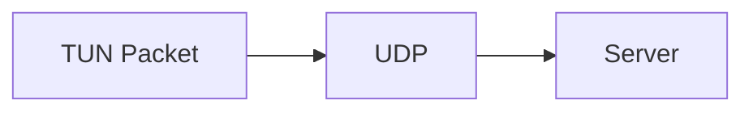
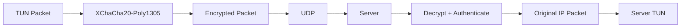
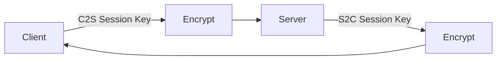

# Layer 3 — Symmetric Packet Encryption

Layer 3 encrypts VPN packets between the client and server with Libsodium's
`crypto_aead_xchacha20poly1305_ietf` authenticated-encryption API. It consumes
the Layer 2 directional session keys; it does not create or transmit keys.

## Before Layer 3

Before Layer 3, the transport forwarded the TUN packet directly through UDP:



## After Layer 3

Client-to-server traffic is encrypted before it is sent. The server decrypts
and authenticates it before writing the original IP packet to its TUN device.
The reverse path applies the same process in the opposite direction.



## Directional Encryption



The client uses `sessionKeys.clientToServer` for TUN-to-server encryption and
`sessionKeys.serverToClient` for server-to-TUN decryption. The server selects a
registered client by the UDP source address, then uses that client's
`sessionKeys.clientToServer` to decrypt. For packets read from the server TUN,
the destination VPN IP selects the client and that client's
`sessionKeys.serverToClient` is used for encryption.

## Packet Format

Each encrypted UDP payload is laid out as:

```text
┌──────────────┬──────────────────────────┐
│ Nonce        │ Ciphertext + Auth Tag    │
└──────────────┴──────────────────────────┘
```

The nonce is exactly
`crypto_aead_xchacha20poly1305_ietf_NPUBBYTES` bytes and is generated with
Libsodium's secure random generator for every packet. It is sent in cleartext
because it is not secret. The session key is never transmitted.

No additional authenticated data is supplied at this stage. No sequence
number is added to the packet format.

## Authentication

XChaCha20-Poly1305 provides confidentiality and an authentication tag for the
encrypted packet. The implementation passes no manually-created hash or MAC
to the transport.

```text
Modified ciphertext
      ↓
Authentication failure
      ↓
    DROP
```

Authentication failures, malformed encrypted payloads, and packets from an
unregistered UDP source are dropped. Failed packets are not written to TUN and
their plaintext is not used.

## Files Changed

Added:

- `crypto/packet_crypto.h`
- `crypto/packet_crypto.cpp`
- `tests/layer3_test.cpp`
- `docs/layer3/README.md`

Modified:

- `client/client1.cpp`
- `client/transport.h`
- `client/transport.cpp`
- `server/forward.cpp`

## Testing

The local Layer 3 test was compiled and run with:

```text
g++ -std=c++17 -Wall -Wextra -Wpedantic \
  tests/layer3_test.cpp crypto/packet_crypto.cpp \
  crypto/session_keys.cpp crypto/handshake.cpp \
  -lsodium -o /tmp/customvpn_layer3_test
/tmp/customvpn_layer3_test
```

It passed these checks:

- C2S encryption/decryption round trip using the derived C2S key;
- S2C encryption/decryption round trip using the derived S2C key;
- modified ciphertext rejection;
- wrong-directional-key rejection; and
- fresh random nonces on separate encryption operations.

Client and server source files also passed `g++ -fsyntax-only` checks with
warnings enabled. The Google Cloud server was not used, so no real
Client-to-Google-Cloud integration test was performed.

## Security Limitations / Future Layers

Replay protection and packet sequence numbers have **not** been implemented.
The same authenticated packet can therefore be replayed until a later layer
adds replay state. Key rotation has also not been implemented.

The existing X25519 handshake remains unauthenticated. XChaCha20-Poly1305
authenticates encrypted packet contents with the established session key, but
it does not by itself authenticate the peer against an active man-in-the-
middle attack.
