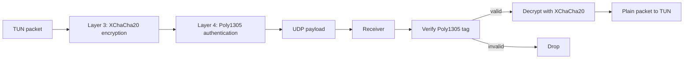

# Layer 4 — Integrity and Authentication

Layer 4 is implemented by the Poly1305 authentication component inside
Libsodium's existing `crypto_aead_xchacha20poly1305_ietf` operation.

This repository does not add a second independent Poly1305 pass. XChaCha20-
Poly1305 is an AEAD construction: the XChaCha20 encryption and Poly1305
authentication tag are produced and verified as one cryptographic operation.
Adding another MAC over the result would be redundant and would create a new
protocol and key-management problem without improving this design.

## Placement in the VPN path

The conceptual layers remain separate:



In the actual Libsodium API, encryption and authentication are combined, so
the sender calls `crypto_aead_xchacha20poly1305_ietf_encrypt()` and the
receiver calls `crypto_aead_xchacha20poly1305_ietf_decrypt()`. Libsodium
verifies the Poly1305 tag before the receiver accepts the plaintext.

## Packet format

The existing packet format is unchanged:

```text
┌──────────────┬──────────────────────────┐
│ XChaCha nonce│ Ciphertext + Poly1305 tag│
└──────────────┴──────────────────────────┘
```

The nonce is generated randomly for each packet and is transmitted in
cleartext. The authentication tag is appended by the AEAD operation inside
the `ciphertext + tag` portion. There is no separately transported Layer 4
field and no additional authentication key.

## Existing session keys and directions

Layer 4 reuses the Layer 2 directional keys. It does not hardcode keys or
derive a new authentication key:

- client to server: `SessionKeys::clientToServer`;
- server to client: `SessionKeys::serverToClient`.

The client encrypts TUN packets with the C2S key and decrypts server packets
with the S2C key. The server performs the inverse operations for the same
registered client. The server identifies the UDP client before attempting
verification, and both transport receivers drop authentication failures
without writing them to TUN.

## Failure behavior

`decryptVpnPacket()` rejects malformed, too-short, oversized, tampered, and
wrong-key packets. A failed Libsodium AEAD verification returns failure; the
caller drops the packet and does not use its plaintext. The client and server
transport paths apply this check before writing any decrypted data to TUN.

No keys, plaintext secrets, or authentication tags are logged. Existing
session-key wiping with `sodium_memzero()` remains unchanged.

## Files involved

The implementation uses the existing Layer 3 packet crypto and Layer 2 key
material:

- `crypto/packet_crypto.h`
- `crypto/packet_crypto.cpp`
- `crypto/session_keys.h`
- `crypto/session_keys.cpp`
- `client/transport.cpp`
- `server/forward.cpp`

Layer 4-specific regression coverage is in:

- `tests/layer4_test.cpp`

## Local validation

```text
g++ -std=c++17 -Wall -Wextra -Wpedantic \
  tests/layer4_test.cpp crypto/packet_crypto.cpp \
  crypto/session_keys.cpp crypto/handshake.cpp \
  -lsodium -o /tmp/customvpn_layer4_test
/tmp/customvpn_layer4_test
```

The test covers:

- valid C2S and S2C authentication;
- modified ciphertext rejection;
- modified Poly1305 tag rejection;
- wrong session-key rejection;
- empty and short packet rejection; and
- ensuring failed verification does not release plaintext to the caller.

This is local cryptographic validation. It is not a live Google Cloud or
end-to-end VPN deployment test.

## Layer 5 status

Replay protection and sequence numbers are not implemented here. A valid
authenticated packet can still be replayed until that separately authorized
layer is added.
