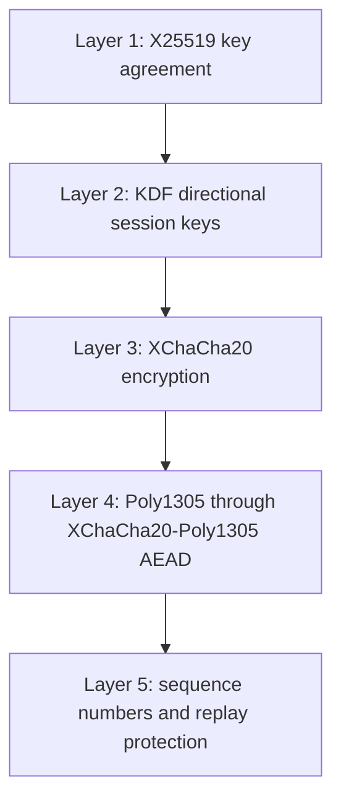
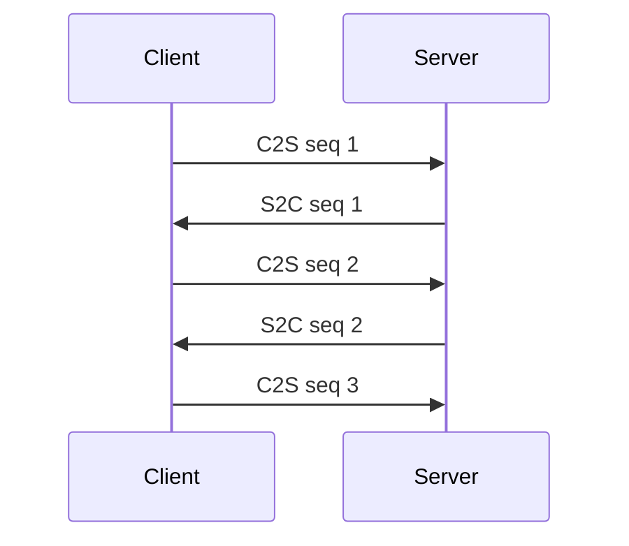
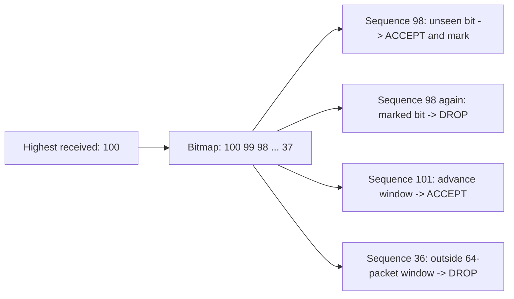
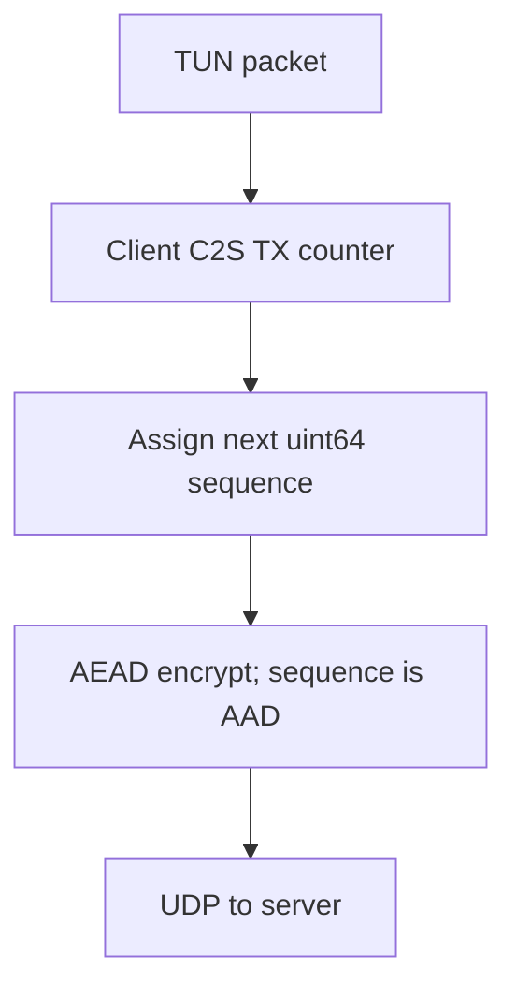
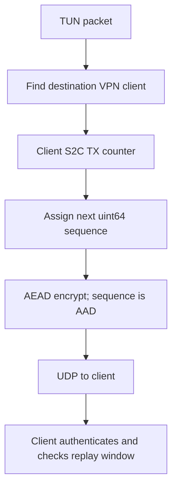
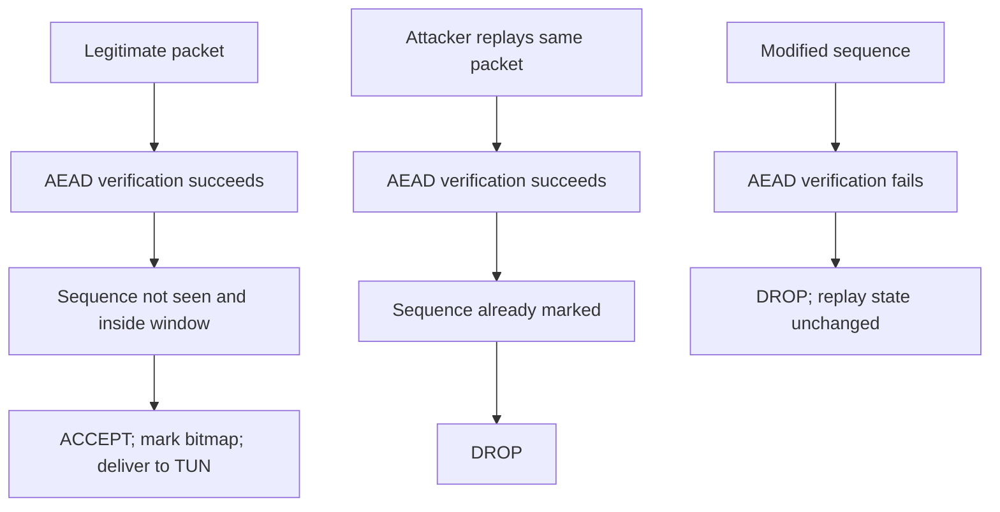

# Layer 5 — Replay Protection

## Purpose

Layer 5 prevents an attacker from capturing a previously authenticated VPN
packet and sending that same packet again later. Layer 4 can prove that a
packet was created with the session key, but it does not prove that the packet
is new. Each VPN direction therefore carries its own monotonically increasing
sequence number.

The five-layer architecture is:



## Why Nonces Are Not Replay Protection

The XChaCha20 nonce is a cryptographic input. A fresh random nonce prevents
unsafe nonce/key reuse and lets the AEAD operation produce a distinct packet.
The nonce does not record whether a receiver has already accepted that packet.

The Layer 5 sequence number provides freshness tracking: the receiver records
accepted numbers and rejects duplicates or numbers that have fallen outside
the replay window.

## Sequence Numbers

Every direction has an independent `uint64_t` counter. A new session starts at
sequence 1:



The sender emits `UINT64_MAX` once and then stops rather than wrapping to
zero. A zero sequence is reserved as invalid for VPN data packets. There is
no implicit key rotation in this layer; exhaustion is reported and the packet
is dropped.

## Replay Window

UDP can deliver valid packets out of order, so a packet is not rejected merely
because it is below the newest packet. Each receiver keeps a fixed 64-bit
bitmap. The newest sequence is the window's high point, and each bitmap bit
records whether the corresponding sequence has already been accepted.



For a newly received higher number, the bitmap shifts toward older numbers;
if the jump is at least 64 packets, only the new high point remains. For an
older number, the receiver checks its bit. A set bit or a distance of 64 or
more is rejected. State is constant-size and is not an unbounded set.

## Packet Format

The live Layer 5 UDP payload is:

```text
┌──────────────────┬────────────────────┬──────────────────────────────┐
│ sequence (8 B)   │ XChaCha nonce (24 B)│ ciphertext + Poly1305 tag    │
│ network byte     │                     │ (plaintext length + 16 B)    │
│ order            │                     │                              │
└──────────────────┴────────────────────┴──────────────────────────────┘
```

The sequence is serialized explicitly in big-endian/network byte order. The
nonce is generated randomly by Libsodium for each packet. The total payload
is bounded by the existing IPv4 UDP payload limit of 65,507 bytes.

## Authentication of Sequence Numbers

The eight serialized sequence bytes are passed as additional authenticated
data to the existing `crypto_aead_xchacha20poly1305_ietf_encrypt()` and
`..._decrypt()` operations. The sequence is visible for routing the replay
check, but changing it without the session key causes AEAD verification to
fail. No custom MAC or additional key is introduced.

The receiver first validates the fixed packet structure and performs AEAD
verification. Only an authenticated sequence is then passed to the replay
window. Plaintext is never written to TUN unless both authentication and
replay checks succeed.

## Client Flow



For server-to-client traffic, the client parses and authenticates the
sequenced packet with `serverToClient`, checks its client RX replay window,
and only then writes the plaintext to TUN.

## Server Flow



For client-to-server traffic, the server first identifies the registered
client by its UDP source address, authenticates/decrypts with that client's
`clientToServer` key, checks that client's C2S replay window, and only then
writes the plaintext to TUN.

## Replay Detection



The resulting behavior is:

- new packet: **ACCEPT**;
- duplicate packet: **DROP**;
- packet too old for the window: **DROP**; and
- unseen out-of-order packet inside the window: **ACCEPT**.

## Session State

Replay state belongs to the current cryptographic session. On the client,
the C2S `SequenceNumberSender` and S2C `ReplayWindow` are created after the
handshake. On the server, every `ClientInfo` owns an S2C sender and a C2S
replay window. A new `ClientInfo` starts with fresh state, and unrelated
clients never share a window or counter.

The existing Layer 2 directional keys are unchanged:

- C2S packets use `SessionKeys::clientToServer`;
- S2C packets use `SessionKeys::serverToClient`.

## Files Changed

Created:

- `crypto/replay_protection.h`
- `crypto/replay_protection.cpp`
- `tests/layer5_test.cpp`
- `docs/layer5/README.md`

Modified:

- `crypto/packet_crypto.h`
- `crypto/packet_crypto.cpp`
- `client/transport.h`
- `client/transport.cpp`
- `client/client1.cpp` (session replay-state construction and thread wiring)
- `server/forward.cpp` (per-client replay state and packet-path integration)

The existing Layer 3/4 packet helpers remain available for their regression
tests. Only the client/server live transport path uses the sequenced format.

## Functions / Classes

- `encryptSequencedVpnPacket()` serializes the sequence, generates the nonce,
  and authenticates the sequence as AEAD additional authenticated data.
- `decryptSequencedVpnPacket()` validates lengths, verifies AEAD, and returns
  the authenticated sequence and plaintext.
- `SequenceNumberSender` provides bounded monotonically increasing TX state
  and rejects sequence-space exhaustion.
- `ReplayWindow` tracks the highest accepted sequence and a 64-bit seen bitmap.
- `tunToServer()` and the server TUN-to-client path assign outgoing numbers.
- `serverToTun()` and the server client-to-TUN path check incoming replay state.

## Testing

The Layer 5 test covers:

- valid and sequential packets;
- exact duplicates and previously accepted older packets;
- out-of-order packets inside the window;
- packets outside the window;
- modified sequence, ciphertext, and authentication tag rejection;
- wrong-key and malformed/truncated packet rejection;
- safe `uint64_t` sequence exhaustion;
- independent directional windows; and
- fresh replay state for a new session.

Local commands:

```text
g++ -std=c++17 -Wall -Wextra -Wpedantic \
  tests/layer5_test.cpp crypto/packet_crypto.cpp \
  crypto/replay_protection.cpp crypto/handshake.cpp \
  -lsodium -o /tmp/customvpn_layer5_test
/tmp/customvpn_layer5_test
```

The existing Layer 3 and Layer 4 tests should also be run with their
documented commands. Client and server builds must link
`crypto/replay_protection.cpp` in addition to the existing crypto sources.

In this checkout, the Layer 5, Layer 3, and Layer 4 local test binaries all
passed. Warning-enabled complete client and server builds also succeeded; the
only warning was the pre-existing unused `status` variable in `tun/setup.cpp`.

## Security Considerations

Layer 5 prevents exact replay and stale-packet replay within a session while
allowing bounded UDP reordering. Authentication occurs before replay state is
updated, so forged packets cannot advance the window. Nonces still need to be
fresh, and the existing AEAD remains responsible for confidentiality and
integrity.

This layer does not authenticate the X25519 handshake against an active
man-in-the-middle, rotate keys, or provide cross-session replay protection
after a key is incorrectly reused. Those concerns are outside Layer 5 and
remain dependent on the existing session-establishment design.

No live client/server VPN test is claimed by this document unless the actual
TUN/UDP path is run successfully; unit tests alone are not end-to-end
verification.
