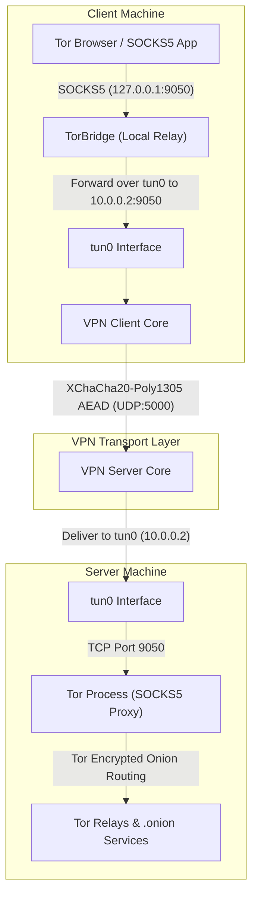
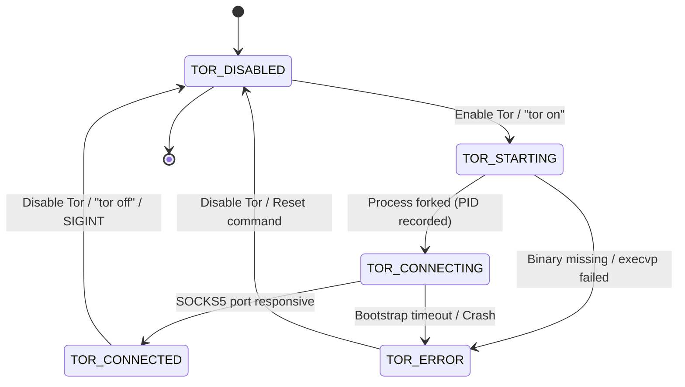

# Tor Mode for Custom VPN

This document provides a complete technical explanation, architecture diagrams, configuration options, and testing procedures for the **Tor Mode** integration in the Custom VPN project.

---

## 1. Overview & Objective

The **Tor Mode** is an optional, additive feature designed to allow users to access `.onion` services (hidden services) and route supported traffic through the Tor network via the existing encrypted VPN tunnel.

### Core Invariants Preserved
- **Default State**: Tor Mode is **OFF** by default.
- **Normal Mode Unchanged**: When Tor Mode is OFF, the VPN behaves **100% identically** to its original implementation.
- **Cryptographic Security Untouched**:
  - X25519 Ephemeral-Static Diffie-Hellman handshake is untouched.
  - BLAKE2s directional session-key derivation is untouched.
  - XChaCha20-Poly1305 AEAD encryption and authenticated framing are untouched.
  - Replay protection with 64-packet sliding window is untouched.
- **No External Daemon Dependency**: A self-contained unprivileged Tor binary is bundled under `tor/bin/tor` (Linux x86_64). If Tor is completely uninstalled from the system, normal VPN still runs without errors.
- **No Destructive Firewall Rules**: No global iptables/nftables flushing or fragile packet interception rules.

---

## 2. Architecture & Data Flow

### 2.1 Normal VPN Mode (Tor Mode = OFF)

Normal VPN traffic flows directly from the client application through the encrypted tunnel to the server, which forwards it to the Internet via NAT:

```mermaid
flowchart LR
    subgraph Client ["Client Machine"]
        App["Client Application"]
        TUN_C["tun0 (10.0.0.1)"]
        VPN_C["VPN Client Process"]
        App -->|Plain IP Packets| TUN_C
        TUN_C -->|Read IP Packets| VPN_C
    end

    subgraph Tunnel ["Encrypted UDP Transport"]
        VPN_C -->|XChaCha20-Poly1305 Encrypted UDP| VPN_S["VPN Server Process"]
    end

    subgraph Server ["Server Machine"]
        VPN_S -->|Decrypted Packets| TUN_S["tun0 (10.0.0.2)"]
        TUN_S -->|Forwarding / NAT| NAT["iptables MASQUERADE"]
        NAT -->|Public IPv4| Internet["Internet / Clearnet"]
    end
```



---

### 2.2 Tor Mode (Tor Mode = ON)

When Tor Mode is activated, Tor Browser or SOCKS5 applications connect to a local bridge (`127.0.0.1:9050`) on the client machine. Traffic is encrypted inside the VPN tunnel, transported to the server (`10.0.0.2:9050`), and handed off to the Tor SOCKS proxy on the server to exit onto the Tor network:



---

## 3. Tor Process Lifecycle & State Machine

The server supervises the Tor daemon using `TorManager`. The lifecycle follows a deterministic state machine:



### State Descriptions
| State | Meaning |
|---|---|
| `TOR_DISABLED` | Tor daemon is not running. All Tor-related sockets are closed. |
| `TOR_STARTING` | Server detected Tor binary and is executing `fork()` / `execvp()`. |
| `TOR_CONNECTING`| Tor process is alive; probing SOCKS port readiness. |
| `TOR_CONNECTED` | Tor SOCKS proxy is fully ready to accept proxy connections on port `9050`. |
| `TOR_ERROR` | Tor failed to start, crashed, or encountered an unrecoverable error. |

---

## 4. Technical Components

The implementation is located under the `tor/` directory:

### 1. `TorConfig` (`tor/tor_config.h`, `tor/tor_config.cpp`)
- Loads settings from environment variables with sensible defaults.
- Automatically searches for Tor binaries in standard Linux paths (`tor/bin/tor`, `../tor/bin/tor`, `/usr/bin/tor`, `/usr/local/bin/tor`, etc.).

### 2. `TorManager` (`tor/tor_manager.h`, `tor/tor_manager.cpp`)
- Singleton process supervisor.
- Spawns Tor with arguments: `--SocksPort 0.0.0.0:9050 --DataDirectory /tmp/custom_vpn_tor_data --PidFile ... --Log notice file ...`.
- Periodically probes SOCKS5 greeting (`\x05\x01\x00` -> `\x05\x00`) to confirm proxy readiness.
- Manages clean shutdown using `SIGTERM`, escalating to `SIGKILL` if necessary, and unlinks PID files.

### 3. `TorBridge` (`tor/tor_bridge.h`, `tor/tor_bridge.cpp`)
- Client-side bidirectional TCP relay.
- Listens on `127.0.0.1:9050` and forwards connections over `tun0` to `10.0.0.2:9050`.
- Allows Tor Browser or applications configured for `localhost:9050` to seamlessly reach the VPN server's Tor daemon.

### 4. Bundled Binary (`tor/bin/tor`)
- Standalone Tor binary (version 0.4.9.11, x86_64 Linux).
- Runs unprivileged without requiring `sudo apt-get install tor`.

---

## 5. Configuration Settings

Tor parameters can be customized via environment variables:

| Environment Variable | Default Value | Description |
|---|---|---|
| `TOR_ENABLED` | `false` | When `true`, automatically starts Tor on server launch. |
| `TOR_SOCKS_HOST` | `0.0.0.0` | Bind address for Tor SOCKS proxy on server. |
| `TOR_SOCKS_PORT` | `9050` | Port for Tor SOCKS proxy. |
| `TOR_BRIDGE_PORT` | `9050` | Port for local `TorBridge` on client. |
| `TOR_SERVER_VPN_IP`| `10.0.0.2` | VPN IP of server where Tor SOCKS proxy runs. |
| `TOR_DATA_DIR` | `/tmp/custom_vpn_tor_data` | Directory for Tor keys, cache, and state. |
| `TOR_BINARY_PATH` | *(Auto-detected)* | Path to `tor` executable. |

---

## 6. Frontend Controls & UI

In the Qt6 GUI client (`frontend/app.cpp`), a dedicated **TOR MODE** section is provided:

```
+---------------------------------------+
| TOR MODE                              |
+---------------------------------------+
| Status: Disabled                      |
| [ Enable Tor ]                        |
|                                       |
| * Routes supported traffic via Tor    |
| * Use Tor Browser for Onion Services  |
+---------------------------------------+
```

- When **Enable Tor** is clicked, it sends an encrypted `tor on` command to the VPN server.
- The UI status updates dynamically:
  - `Status: Connecting...` (yellow)
  - `Status: Connected ✓` (green)
  - `Status: Error ✗` (red)
  - `Status: Disabled` (gray)
- Clicking **Disable Tor** terminates the Tor process and resets the state.

---

## 7. Testing & Verification

### 7.1 Running the Automated Test Suite

Build the project and run the tests:

```bash
# Build
cmake -B build -S .
cmake --build build -j$(nproc)

# Run existing core VPN tests
./build/test_layer3
./build/test_layer4
./build/test_layer5

# Run Tor unit and end-to-end tests
./build/test_tor_manager
./build/test_tor_e2e
```

---

### 7.2 The 4 Required Verification Scenarios

1. **Test 1 — Normal VPN (Tor Mode OFF)**
   - Run VPN client and server without enabling Tor.
   - Normal clearnet traffic forwards through `tun0` -> NAT.
   - Handshake, ChaCha20-Poly1305 encryption, and replay protection operate normally.

2. **Test 2 — Tor Mode ON**
   - Enable Tor Mode via frontend or `"tor on"`.
   - Tor starts and reaches `Connected`.
   - Local `TorBridge` binds to `127.0.0.1:9050`.

3. **Test 3 — Disable Tor**
   - Disable Tor Mode via frontend or `"tor off"`.
   - Tor process receives `SIGTERM` and shuts down cleanly.
   - SOCKS port is freed, and normal VPN routing remains active.

4. **Test 4 — Tor Unavailable**
   - If Tor binary is removed or invalid path is specified:
   - System reports clear error: `Tor is not installed on the system`.
   - VPN continues operating without crashes.

---

### 7.3 Testing `.onion` Reachability

#### With `curl`:
```bash
# Query DuckDuckGo's official onion service
curl -x socks5h://127.0.0.1:9050 -I http://duckduckgogg42xjoc72x3sjasowoarfbgcmvfimaftt6twagswzczad.onion
```
Expected output:
```http
HTTP/1.1 301 Moved Permanently
Location: https://duckduckgogg42xjoc72x3sjasowoarfbgcmvfimaftt6twagswzczad.onion/
```

#### With Tor Browser:
1. Open Tor Browser.
2. In **Settings** &rarr; **Connection Settings**, select **Manual proxy configuration**:
   - **SOCKS Host**: `127.0.0.1`
   - **Port**: `9050`
   - **Proxy DNS when using SOCKS v5**: Checked
3. Navigate to `http://duckduckgogg42xjoc72x3sjasowoarfbgcmvfimaftt6twagswzczad.onion`.

---

## 8. Safety & Privacy Notice

> [!WARNING]
> Tor Mode routes supported application traffic through the Tor network. It does not provide absolute anonymity by itself. For full anonymity protections, always use **Tor Browser** configured to use the SOCKS5 proxy to access Onion services, as the browser includes protections against fingerprinting, cookie leaks, and DNS leakage.
